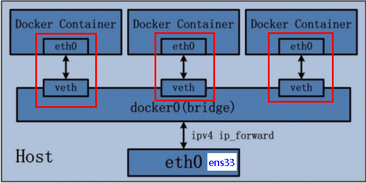
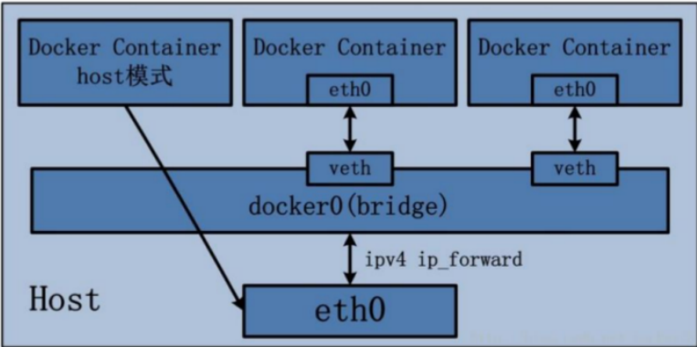
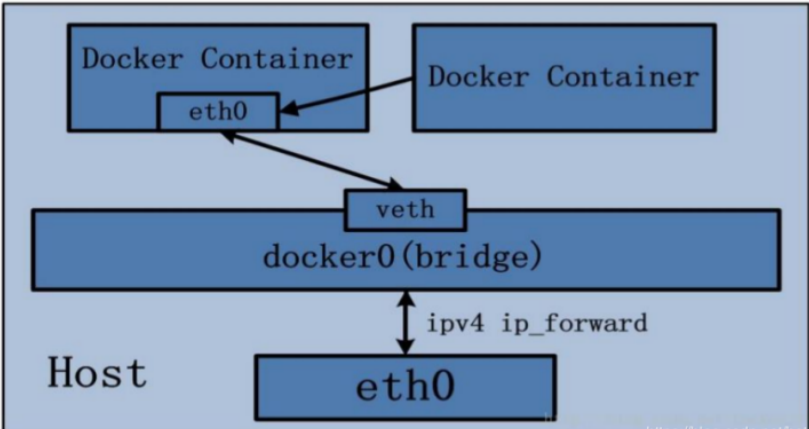

# Docker网络

## 是什么

docker启动后，网络情况（以centos7为例）

```bash
[root@simon ~]# ifconfig
docker0: flags=4099<UP,BROADCAST,MULTICAST>  mtu 1500
        inet 172.17.0.1  netmask 255.255.0.0  broadcast 172.17.255.255
        ether 02:42:2b:6f:7d:11  txqueuelen 0  (Ethernet)
        RX packets 0  bytes 0 (0.0 B)
        RX errors 0  dropped 0  overruns 0  frame 0
        TX packets 0  bytes 0 (0.0 B)
        TX errors 0  dropped 0 overruns 0  carrier 0  collisions 0

ens33: flags=4163<UP,BROADCAST,RUNNING,MULTICAST>  mtu 1500
        inet 192.168.233.130  netmask 255.255.255.0  broadcast 192.168.233.255
        inet6 fe80::f531:59dd:af09:5875  prefixlen 64  scopeid 0x20<link>
        ether 00:0c:29:7e:f9:81  txqueuelen 1000  (Ethernet)
        RX packets 845  bytes 474854 (463.7 KiB)
        RX errors 0  dropped 0  overruns 0  frame 0
        TX packets 600  bytes 59728 (58.3 KiB)
        TX errors 0  dropped 0 overruns 0  carrier 0  collisions 0

lo: flags=73<UP,LOOPBACK,RUNNING>  mtu 65536
        inet 127.0.0.1  netmask 255.0.0.0
        inet6 ::1  prefixlen 128  scopeid 0x10<host>
        loop  txqueuelen 1000  (Local Loopback)
        RX packets 64  bytes 5312 (5.1 KiB)
        RX errors 0  dropped 0  overruns 0  frame 0
        TX packets 64  bytes 5312 (5.1 KiB)
        TX errors 0  dropped 0 overruns 0  carrier 0  collisions 0
```

会产生一个名为docker0的虚拟网桥

查看docker网络模式命令

```bash
docker network ls
```

```bash
[root@simon ~]# docker network ls
NETWORK ID     NAME      DRIVER    SCOPE
36117db4952b   bridge    bridge    local
e6430bc21c34   host      host      local
a791e1d96cbd   none      null      local
```

默认创建3大网络模式

## 基本命令

直接执行`docker network --help`就有详细的说明

```bash
[root@simon ~]# docker network --help

Usage:  docker network COMMAND

Manage networks

Commands:
  connect     Connect a container to a network
  create      Create a network
  disconnect  Disconnect a container from a network
  inspect     Display detailed information on one or more networks
  ls          List networks
  prune       Remove all unused networks
  rm          Remove one or more networks
```

## 能干嘛

容器间的互联和通信以及端口映射

容器IP变动时候可以通过服务名直接网络通信而不受到影响

## 网络模式

| 网络模式  | 简介                                                         |
| --------- | ------------------------------------------------------------ |
| bridge    | 为每一个容器分配、设置IP等，并将容器连接到一个`docker0` <br />虚拟网桥，默认为该模式。 |
| host      | 容器将不会虚拟出自己的网卡，配置自己的IP等，二十使用宿主机的IP和端口 |
| none      | 容器独有的Network namespace，但并没有对其进行任何网络设置，如分配veth pair和网桥连接，IP等 |
| container | 新创建的容器不会创建自己的网卡和配置自己的IP，而是和一个执行的容器共享IP、端口范围等 |

- bridge模式：使用--network  bridge指定，默认使用docker0
- host模式：使用--network host指定
- none模式：使用--network none指定
- container模式：使用--network container:NAME或者容器ID指定

### bridge

Docker 服务默认会创建一个 docker0 网桥（其上有一个 docker0 内部接口），该桥接网络的名称为docker0，它在内核层连通了其他的物理或虚拟网卡，这就将所有容器和本地主机都放到同一个物理网络。Docker 默认指定了 docker0 接口 的 IP 地址和子网掩码，让主机和容器之间可以通过网桥相互通信。

查看 bridge 网络的详细信息，并通过 grep 获取名称项

```bash
root@simon:~# docker network inspect bridge |grep name
            "com.docker.network.bridge.name": "docker0",
```

ifconfig

```bash
root@simon:~# ifconfig |grep docker
docker0: flags=4163<UP,BROADCAST,RUNNING,MULTICAST>  mtu 1500
```

- Docker使用Linux桥接，在宿主机虚拟一个Docker容器网桥(docker0)，Docker启动一个容器时会根据Docker网桥的网段分配给容器一个IP地址，称为Container-IP，同时Docker网桥是每个容器的默认网关。因为在同一宿主机内的容器都接入同一个网桥，这样容器之间就能够通过容器的Container-IP直接通信。
- docker run 的时候，没有指定network的话默认使用的网桥模式就是bridge，使用的就是docker0。在宿主机ifconfig,就可以看到docker0和自己create的network(后面讲)eth0，eth1，eth2……代表网卡一，网卡二，网卡三……，lo代表127.0.0.1，即localhost，inet addr用来表示网卡的IP地址
- 网桥docker0创建一对对等虚拟设备接口一个叫veth，另一个叫eth0，成对匹配。
  - 整个宿主机的网桥模式都是docker0，类似一个交换机有一堆接口，每个接口叫veth，在本地主机和容器内分别创建一个虚拟接口，并让他们彼此联通（这样一对接口叫veth pair）；
  - 每个容器实例内部也有一块网卡，每个接口叫eth0；
  - docker0上面的每个veth匹配某个容器实例内部的eth0，两两配对，一一匹配。
- 通过上述，将宿主机上的所有容器都连接到这个内部网络上，两个容器在同一个网络下,会从这个网关下各自拿到分配的ip，此时两个容器的网络是互通的。



#### 示例

运行两个实例

```bash
docker run -d -p 8081:8080 --name tomcat81 billygoo/tomcat8-jdk8
docker run -d -p 8082:8080 --name tomcat82 billygoo/tomcat8-jdk8
```

#### 查看

```bash

27: vethc5e7f45@if26: <BROADCAST,MULTICAST,UP,LOWER_UP> mtu 1500 qdisc noqueue master docker0 state UP group default
    link/ether b2:ac:61:da:73:2d brd ff:ff:ff:ff:ff:ff link-netnsid 3
    inet6 fe80::b0ac:61ff:feda:732d/64 scope link
       valid_lft forever preferred_lft forever
29: veth27a5c19@if28: <BROADCAST,MULTICAST,UP,LOWER_UP> mtu 1500 qdisc noqueue master docker0 state UP group default
    link/ether 16:14:6c:2a:61:a7 brd ff:ff:ff:ff:ff:ff link-netnsid 4
    inet6 fe80::1414:6cff:fe2a:61a7/64 scope link
       valid_lft forever preferred_lft forever

root@simon:~# docker exec -it tomcat81 bash
root@e96617b5435c:/usr/local/tomcat# ip addr
1: lo: <LOOPBACK,UP,LOWER_UP> mtu 65536 qdisc noqueue state UNKNOWN group default qlen 1000
    link/loopback 00:00:00:00:00:00 brd 00:00:00:00:00:00
    inet 127.0.0.1/8 scope host lo
       valid_lft forever preferred_lft forever
26: eth0@if27: <BROADCAST,MULTICAST,UP,LOWER_UP> mtu 1500 qdisc noqueue state UP group default
    link/ether 02:42:ac:11:00:05 brd ff:ff:ff:ff:ff:ff link-netnsid 0
    inet 172.17.0.5/16 brd 172.17.255.255 scope global eth0
       valid_lft forever preferred_lft forever
root@e96617b5435c:/usr/local/tomcat# exit
root@simon:~# docker exec -it tomcat82 bash
root@8490c11950ca:/usr/local/tomcat# ip addr
1: lo: <LOOPBACK,UP,LOWER_UP> mtu 65536 qdisc noqueue state UNKNOWN group default qlen 1000
    link/loopback 00:00:00:00:00:00 brd 00:00:00:00:00:00
    inet 127.0.0.1/8 scope host lo
       valid_lft forever preferred_lft forever
28: eth0@if29: <BROADCAST,MULTICAST,UP,LOWER_UP> mtu 1500 qdisc noqueue state UP group default
    link/ether 02:42:ac:11:00:06 brd ff:ff:ff:ff:ff:ff link-netnsid 0
    inet 172.17.0.6/16 brd 172.17.255.255 scope global eth0
       valid_lft forever preferred_lft forever
root@8490c11950ca:/usr/local/tomcat#
```

### host 

直接使用宿主机的 IP 地址与外界进行通信，不再需要额外进行NAT 转换。

容器将不会获得一个独立的Network Namespace， 而是和宿主机共用一个Network Namespace。容器将不会虚拟出自己的网卡而是使用宿主机的IP和端口。



使用

```bash
docker run --network host -d --name tomcat83 billygoo/tomcat8-jdk8
```

没必要加-p，不过加了也不起作用是了

docker启动时指定--network=host或-net=host，如果还指定了-p映射端口，那这个时候就会有此警告，

并且通过-p设置的参数将不会起到任何作用，端口号会以主机端口号为主，重复时则递增。

#### 查看示例容器内部

```bash
            "Networks": {
                "host": {
                    "IPAMConfig": null,
                    "Links": null,
                    "Aliases": null,
                    "NetworkID": "54bf39b25f15348207ffe4464a8f69e6ee0b81092601a80e9cf8f91ba03d3264",
                    "EndpointID": "922e892c8f6464375a8f9f6b209160751fffbeb4a16a1caa0f93d89c5d9b84d3",
                    "Gateway": "",
                    "IPAddress": "",
                    "IPPrefixLen": 0,
                    "IPv6Gateway": "",
                    "GlobalIPv6Address": "",
                    "GlobalIPv6PrefixLen": 0,
                    "MacAddress": "",
                    "DriverOpts": null

```

### none

在none模式下，并不为Docker容器进行任何网络配置。 

也就是说，这个Docker容器没有网卡、IP、路由等信息，只有一个lo

需要我们自己为Docker容器添加网卡、配置IP等。

**禁用网络功能，只有lo标识(就是127.0.0.1表示本地回环)**

#### 示例

```bash
docker run -d -p 8084:8080 --network none --name tomcat84 billygoo/tomcat8-jdk8
```

```bash
root@simon:~# docker inspect tomcat84 |tail -n 20
            "Networks": {
                "none": {
                    "IPAMConfig": null,
                    "Links": null,
                    "Aliases": null,
                    "NetworkID": "331f7ab585a3056cace45594e98e30a746d2c68840e5445276148762b85ab436",
                    "EndpointID": "7d1554f0fd654714215dd0cfb73ce8b3b019c9c7fd3249731efcb7926417905b",
                    "Gateway": "",
                    "IPAddress": "",
                    "IPPrefixLen": 0,
                    "IPv6Gateway": "",
                    "GlobalIPv6Address": "",
                    "GlobalIPv6PrefixLen": 0,
                    "MacAddress": "",
                    "DriverOpts": null
                }
            }
        }
    }
]
```

### container

新建的容器和已经存在的一个容器共享一个网络ip配置而不是和宿主机共享。新创建的容器不会创建自己的网卡，配置自己的IP，而是和一个指定的容器共享IP、端口范围等。同样，两个容器除了网络方面，其他的如文件系统、进程列表等还是隔离的。



#### 错误示例

```bash
docker run -d -p 8085:8080 --name tomcat85 billygoo/tomcat8-jdk8
docker run -d -p 8086:8080 --name tomcat85 billygoo/tomcat8-jdk8 --name tomcat86 billygoo/tomcat8-jdk8
```

报错

```bash
root@simon:~# docker run -d -p 8086:8080 --name tomcat85 billygoo/tomcat8-jdk8 --name tomcat86 billygoo/tomcat8-jdk8
docker: Error response from daemon: Conflict. The container name "/tomcat85" is already in use by container "5fd710e01fa5621bd2a61649277018861ef32ff75da32fcdbcaefc856b8b58d2". You have to remove (or rename) that container to be able to reuse that name.
See 'docker run --help'.
```

相当于tomcat86和tomcat85公用同一个ip同一个端口，导致端口冲突

#### 正确示例

删除tomcat85，`docker rm -f tomcat85`

Alpine Linux 是一款独立的、非商业的通用 Linux 发行版，专为追求安全性、简单性和资源效率的用户而设计。 可能很多人没听说过这个 Linux 发行版本，但是经常用 Docker 的朋友可能都用过，因为他小，简单，安全而著称，所以作为基础镜像是非常好的一个选择，可谓是麻雀虽小但五脏俱全，镜像非常小巧，不到 6M的大小，所以特别适合容器打包。

```bash
docker run -it --name alpine1  alpine /bin/sh
docker run -it --network container:alpine1 --name alpine2  alpine /bin/sh
```

在**alpine1**上执行`ip addr`

```bash
/ # ip addr
1: lo: <LOOPBACK,UP,LOWER_UP> mtu 65536 qdisc noqueue state UNKNOWN qlen 1000
    link/loopback 00:00:00:00:00:00 brd 00:00:00:00:00:00
    inet 127.0.0.1/8 scope host lo
       valid_lft forever preferred_lft forever
32: eth0@if33: <BROADCAST,MULTICAST,UP,LOWER_UP,M-DOWN> mtu 1500 qdisc noqueue state UP
    link/ether 02:42:ac:11:00:07 brd ff:ff:ff:ff:ff:ff
    inet 172.17.0.7/16 brd 172.17.255.255 scope global eth0
       valid_lft forever preferred_lft forever
```

在**alpine2**上执行`ip addr`

```bash
/ # ip addr
1: lo: <LOOPBACK,UP,LOWER_UP> mtu 65536 qdisc noqueue state UNKNOWN qlen 1000
    link/loopback 00:00:00:00:00:00 brd 00:00:00:00:00:00
    inet 127.0.0.1/8 scope host lo
       valid_lft forever preferred_lft forever
32: eth0@if33: <BROADCAST,MULTICAST,UP,LOWER_UP,M-DOWN> mtu 1500 qdisc noqueue state UP
    link/ether 02:42:ac:11:00:07 brd ff:ff:ff:ff:ff:ff
    inet 172.17.0.7/16 brd 172.17.255.255 scope global eth0
       valid_lft forever preferred_lft forever
```

此时关闭**alpine1**后，在**alpine2**上执行`ip addr`

```bash
/ # ip addr
1: lo: <LOOPBACK,UP,LOWER_UP> mtu 65536 qdisc noqueue state UNKNOWN qlen 1000
    link/loopback 00:00:00:00:00:00 brd 00:00:00:00:00:00
    inet 127.0.0.1/8 scope host lo
       valid_lft forever preferred_lft forever
```

eth0@if33消失

### 自定义网络

`--link`已经过时

需求：

让两台docker能稳定地ping通，使用服务名ping是比较好的实现方式

#### 失败实现示例

如果已经执行过就跳过这一步

```bash
docker run -d -p 8081:8080   --name tomcat81 billygoo/tomcat8-jdk8

docker run -d -p 8082:8080   --name tomcat82 billygoo/tomcat8-jdk8
```

进入这两个实例，尝试ping通对方IP

```bash
28: eth0@if29: <BROADCAST,MULTICAST,UP,LOWER_UP> mtu 1500 qdisc noqueue state UP group default
    link/ether 02:42:ac:11:00:06 brd ff:ff:ff:ff:ff:ff link-netnsid 0
    inet 172.17.0.6/16 brd 172.17.255.255 scope global eth0
       valid_lft forever preferred_lft forever
root@8490c11950ca:/usr/local/tomcat# ping 172.17.0.5
PING 172.17.0.5 (172.17.0.5) 56(84) bytes of data.
64 bytes from 172.17.0.5: icmp_seq=1 ttl=64 time=0.128 ms
64 bytes from 172.17.0.5: icmp_seq=2 ttl=64 time=0.103 ms
64 bytes from 172.17.0.5: icmp_seq=3 ttl=64 time=0.081 ms
```

尝试通过服务名ping

```bash
root@8490c11950ca:/usr/local/tomcat# ping tomcat82
ping: tomcat82: Name or service not known
root@8490c11950ca:/usr/local/tomcat# ping tomcat81
ping: tomcat81: Name or service not known
```

假设tomcat81实例down掉后有一台新实例启动，占用掉了原来的ip，此时重启tomcat81所得到的ip不会是原来的那个，因此不能这样实现

#### 成功实现示例

将上面两个实例删除

创建一个网络

```bash
docker network create simon_network
```

启动两个实例

```bash
docker run -d -p 8081:8080 --network simon_network --name tomcat81 billygoo/tomcat8-jdk8

docker run -d -p 8082:8080 --network simon_network --name tomcat82 billygoo/tomcat8-jdk8
```

分别进入到这两个容器

```bash
docker exec -it tomcat81 bash
docker exec -it tomcat82 bash
```

在tomcat81上ping tomcat82

```bash
root@3eab0c0a66ef:/usr/local/tomcat# ping tomcat82
PING tomcat82 (172.19.0.3) 56(84) bytes of data.
64 bytes from tomcat82.simon_network (172.19.0.3): icmp_seq=1 ttl=64 time=0.106 ms
64 bytes from tomcat82.simon_network (172.19.0.3): icmp_seq=2 ttl=64 time=0.093 ms
```

在tomcat82上ping tomcat81

```bash
root@a5661cd39dd5:/usr/local/tomcat# ping tomcat81
PING tomcat81 (172.19.0.2) 56(84) bytes of data.
64 bytes from tomcat81.simon_network (172.19.0.2): icmp_seq=1 ttl=64 time=0.069 ms
64 bytes from tomcat81.simon_network (172.19.0.2): icmp_seq=2 ttl=64 time=0.092 ms
```

自定义网络本身就维护好了主机名和ip的对应关系（ip和域名都能通）
