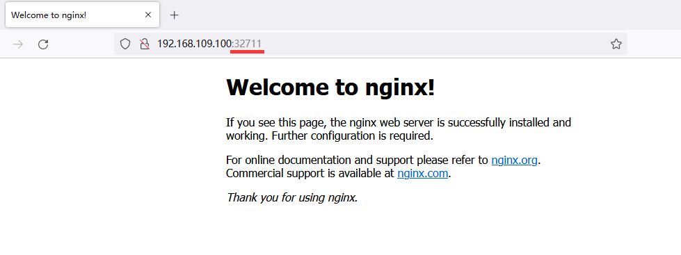

注意，这个笔记是对别人笔记的补充

在虚拟机上安装操作系统

# 环境部署

## 环境初始化

### 主机规划

| 作用   | IP地址          | 操作系统                 | 配置                  |
| ------ | --------------- | ------------------------ | --------------------- |
| Master | 192.168.109.100 | Centos7.9 基础设施服务器 | 2颗CPU 2G内存 50G硬盘 |
| Node1  | 192.168.109.101 | Centos7.9 基础设施服务器 | 2颗CPU 2G内存 50G硬盘 |
| Node2  | 192.168.109.102 | Centos7.9 基础设施服务器 | 2颗CPU 2G内存 50G硬盘 |

本次采用vmware虚拟机方式安装三台主机，软件选择基础设施服务器，语言为中文简体，时区为上海

### 主机名

```
master节点：master
node1节点：node1
node2节点：node2
```

### 主机名解析

（分别三台虚拟机上操作）

往`/etc/hosts`追加以下行，方便以后调用

```
192.168.109.100 master
192.168.109.101 node1
192.168.109.102 node2
```

### 时间同步

（分别三台虚拟机上操作）

kubernetes要求集群中的节点时间必须精确一致这里使用chronyd服务从网络同步时间

```bash
systemctl start chronyd
systemctl enable chronyd
```

### 禁用iptables和firewalld服务

（分别三台虚拟机上操作）

kubernetes和docker在运行中会产生大量的iptables规则，为了不让系统规则跟它们混淆，直接关闭系统规则

centos7没有iptables，因此禁用firewall就好

```bash
systemctl stop firewalld.service
systemctl disable firewalld.service
```

### 禁用selinux

（分别三台虚拟机上操作）

selinux是linux系统下的一个安全服务，如果不关闭它，在安装集群中会产生各种奇葩问题

```bash
nano /etc/selinux/config
# 将SELINUX=enforcing改为
SELINUX=disabled
```

注意，如果写错了单词系统启动时会失败！

### 禁用SWAP分区

（分别三台虚拟机上操作）

swap分区指的是虚拟内存分区，它的作用是在物理内存使用完之后，将磁盘分区虚拟成内存来使用

启用swap设备会对系统的性能产生非常负面的影响，因此kubernetes要求每个节点都要禁用swap设备

但是如果因为某些原因确实不能关闭swap分区，就需要在集群安装过程中通过明确的参数进行配置说明

```bash
# 编辑分区配置文件/etc/fstab，注释掉swap分区一行
# 需要重启linux才生效
# 注释错了会导致系统启动失败
# 下面是一个成功例子
/dev/mapper/centos-swap swap                    swap    defaults        0 0
# 改成
# /dev/mapper/centos-swap swap                    swap    defaults        0 0
```

### 修改linux的内核参数

（分别三台虚拟机上操作）

```bash
# 添加网桥过滤和启动地址转发功能
# 编辑/etc/sysctl.d/kubernetes.conf文件，添加如下配置
net.bridge.bridge-nf-call-ip6tables = 1
net.bridge.bridge-nf-call-iptables = 1
net.ipv4.ip_forward = 1

# 重新加载配置
sysctl -p

# 加载网桥过滤模块
modprobe br_netfilter

# 查看网桥过滤模块是否加载成功
lsmod | grep br_netfilter
```

### 配置ipvs功能

（分别三台虚拟机上操作）

在kubernetes中service有两种代理模型，一种是基于iptables，一种是基于ipvs的

两者比较的的话，ipvs性能明显要高一些，但是如果要使用它，需要手动载入ipvs模块

```bash
# 安装ipset和ipvsadm
yum install ipset ipvsadm -y

# 添加需要加载的模块写入脚本文件
cat <<EOF> /etc/sysconfig/modules/ipvs.modules 
#!/bin/bash
modprobe -- ip_vs
modprobe -- ip_vs_rr
modprobe -- ip_vs_wrr
modprobe -- ip_vs_sh
modprobe -- nf_conntrack_ipv4
EOF

# 为脚本文件添加执行权限
chmod +x /etc/sysconfig/modules/ipvs.modules

# 执行脚本文件
/bin/bash /etc/sysconfig/modules/ipvs.modules

# 查看对应的模块是否加载成功
lsmod |grep -e ip_vs -e nf_conntrack_ipv4
```

### 重启服务器

（分别三台虚拟机上操作）

## 环境搭建

在**每台**服务器上分别安装docker、kubeadm、kubelet、kubectl程序

### 安装docker

```bash
# 切换镜像源
wget http://mirrors.aliyun.com/docker-ce/linux/centos/docker-ce.repo -O /etc/yum.repos.d/docker-ce.repo

# 查看当前镜像源中支持的docker版本
yum list docker-ce --showduplicates

# 安装特定版本的docker-ce
yum install --setopt=obsoletes=0 docker-ce-18.06.3.ce-3.el7 -y

# 添加一个配置文件
# Docker在默认情况下使用的Cgroup Driver为cgroupfs，而kubernetes推荐使用systemd来替代cgroupfs
mkdir /etc/docker
cat <<EOF > /etc/docker/daemon.json
{
  "exec-opts": ["native.cgroupdriver=systemd"],
  "registry-mirrors": ["https://kn0t2bca.mirror.aliyuncs.com"]
}
EOF

# 启动docker
systemctl start docker
systemctl enable docker

# 检查docker状态和版本
```

### 安装kubernetes组件

```bash
# 由于kubernetes的镜像源在国外，速度比较慢，这里切换成国内的镜像源
cat <<EOF > /etc/yum.repos.d/kubernetes.repo
[kubernetes]
name=Kubernetes
baseurl=http://mirrors.aliyun.com/kubernetes/yum/repos/kubernetes-el7-x86_64
enabled=1
gpgcheck=0
repo_gpgcheck=0
gpgkey=http://mirrors.aliyun.com/kubernetes/yum/doc/yum-key.gpg
http://mirrors.aliyun.com/kubernetes/yum/doc/rpm-package-key.gpg
EOF

# 安装kubeadm、kubelet和kubectl
yum install --setopt=obsoletes0 kubeadm-1.17.4-0 kubelet-1.17.4-0 kubectl-1.17.4-0 -y

# 配置kubelet的cgroup
nano /etc/sysconfig/kubelet
KUBELET_CGROUP_ARGS="--cgroup-driver=systemd"
KUBE_PROXY_MODE="ipvs"

# 设置kubelet开机自启
systemctl enable kubelet
```

## 创建集群

在安装kubernetes集群之前，必须要提前准备好集群需要的镜像，所需镜像可以通过下面命令查看

```
kubeadm config images list
```

以下只需要在**master**上执行

```bash
# 创建集群
kubeadm init \
  --kubernetes-version v1.17.4 \
  --pod-network-cidr=10.244.0.0/16 \
  --service-cidr=10.96.0.0/12 \
  --apiserver-advertise-address=192.168.109.100 \
  --image-repository registry.aliyuncs.com/google_containers  

# 创建必要文件
mkdir -p $HOME/.kube
sudo cp -i /etc/kubernetes/admin.conf $HOME/.kube/config
sudo chown $(id -u):$(id -g) $HOME/.kube/config


```

以下在**node**节点上执行，用来加入节点（**root身份**）

```bash
kubeadm join 192.168.109.100:6443 --token 6a3p59.8py6bl6bifle8azl \
    --discovery-token-ca-cert-hash sha256:08b063232f932643debc3986dc9d890972385097c5dde6b6266f24e748558dfa
```

注意，这命令不会跟我一样，具体要看`kubeadm init`完成时的提示

### 安装网络插件

kubernetes支持多种网络插件，比如flannel、calico、canal等等，任选一种使用即可，本次选择flannel

以下只需在**master**上执行

```bash
kubectl apply -f https://raw.githubusercontent.com/coreos/flannel/master/Documentation/kube-flannel.yml
```

如果等了很久`kubectl get nodes`结果里三台没有全部ready的话，尝试在node节点上执行`kubeadm config images pull`（自行解决网络问题）

```bash
[root@master ~]# kubectl get nodes
NAME     STATUS   ROLES    AGE   VERSION
master   Ready    master   25m   v1.17.4
node1    Ready    <none>   20m   v1.17.4
node2    Ready    <none>   20m   v1.17.4
```

自此，kubernetes安装完毕

## 验证

部署nginx

```bash
# 部署nginx
kubectl create deployment nginx --image=nginx

[root@master ~]# kubectl create deployment nginx --image=nginx
deployment.apps/nginx created


# 暴露端口
kubectl expose deployment nginx --port=80 --type=NodePort

[root@master ~]# kubectl expose deployment nginx --port=80 --type=NodePort
service/nginx exposed


# 查看服务状态
kubectl get pod,svc

[root@master ~]# kubectl get pod,svc
NAME                         READY   STATUS    RESTARTS   AGE
pod/nginx-86c57db685-d4vjf   1/1     Running   0          40s

NAME                 TYPE        CLUSTER-IP   EXTERNAL-IP   PORT(S)        AGE
service/kubernetes   ClusterIP   10.96.0.1    <none>        443/TCP        27m
service/nginx        NodePort    10.96.7.57   <none>        80:32711/TCP   17s

# 在电脑上访问部署的nginx服务
```


