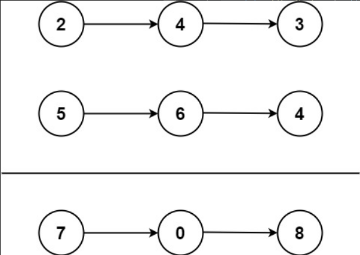

---

---

# [2. 两数相加](https://leetcode-cn.com/problems/add-two-numbers/)

## 题目

给你两个 非空 的链表，表示两个非负的整数。它们每位数字都是按照 逆序 的方式存储的，并且每个节点只能存储 一位 数字。

请你将两个数相加，并以相同形式返回一个表示和的链表。

你可以假设除了数字 0 之外，这两个数都不会以 0 开头。



示例 1：

```markdown
输入：l1 = [2,4,3], l2 = [5,6,4]
输出：[7,0,8]
解释：342 + 465 = 807.
```

示例 2：

```markdown
输入：l1 = [0], l2 = [0]
输出：[0]
```

示例 3：

```markdown
输入：l1 = [9,9,9,9,9,9,9], l2 = [9,9,9,9]
输出：[8,9,9,9,0,0,0,1]
```

来源：力扣（LeetCode）
链接：https://leetcode-cn.com/problems/add-two-numbers
著作权归领扣网络所有。商业转载请联系官方授权，非商业转载请注明出处。

## 我的代码

```python
# Definition for singly-linked list.
# class ListNode:
#     def __init__(self, val=0, next=None):
#         self.val = val
#         self.next = next
class Solution:
    def addTwoNumbers(self, l1: ListNode, l2: ListNode) -> ListNode:
        num1 = ""
        num2 = ""
        while l1 is not None:
            num1 = str(l1.val) + str(num1)
            l1 = l1.next
        while l2 is not None:
            num2 = str(l2.val) + str(num2)
            l2 = l2.next
        result = int(num1) + int(num2)
        result = list(map(int, str(result)))
        l3 = ListNode(result[len(result) - 1])
        current = l3
        for i in range(len(result) - 2, -1, -1):
            new_node = ListNode(result[i])
            current.next = new_node
            current = current.next
        return l3
```

## 我的解题思路

将所有的数字以头部插入的方式拼接成一个完整数字

```python
        while l1 is not None:
            num1 = str(l1.val) + str(num1)
            l1 = l1.next
```

如：[1, 4, 6]

经过这个循环后会变成`num1 = 641`，类型是`str`


将得到的完整字符转换成`int`类型后相加

将数字转成一个列表

```python
        result = int(num1) + int(num2)
        result = list(map(int, str(result)))
```


用l3表示一个新建的链头，`result[len(result) - 1]`表示的是最后一个数字

用current指向l3，要这么做的原因是最后返回链头而不是链尾

```python
        l3 = ListNode(result[len(result) - 1])
        current = l3
```


使用for循环将数字倒插到l3的链接结构中，然后大功告成！

```python
        for i in range(len(result) - 2, -1, -1):
            new_node = ListNode(result[i])
            current.next = new_node
            current = current.next
            
            return l3
```